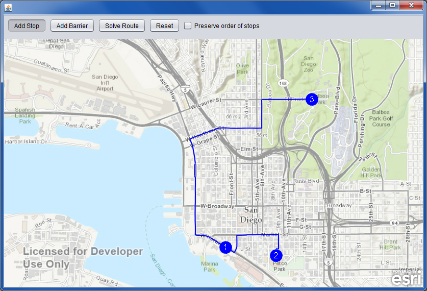

offline-routing-java
====================

An offline routing demo of the ArcGIS Runtine SDK for Java. This is just like the [point-to-point routing sample](https://developers.arcgis.com/java/sample-code/point-to-point-routing/) included in the ArcGIS Runtime SDK, except that instead of using an ArcGIS Online service to do the routing, it uses [an offline geodatabase available for download on ArcGIS Online](http://www.arcgis.com/home/item.html?id=bd441813cd2f4c8891aee671a65feb54).

1. Clone this repo, or fork and clone your fork.
2. Download the [San Diego Routing and Locator Dataset](http://www.arcgis.com/home/item.html?id=bd441813cd2f4c8891aee671a65feb54), or use your own offline geodatabase with routing data.
3. Place the offline geodatabase in the repo's OfflineRoutingApp directory. If you use the San Diego sample data, copy both RuntimeSanDiego.geodatabase and the RuntimeSanDiego.tn directory.
4. Build and run the app. You can use Ant, NetBeans, or the IDE of your choice.

If you would like to contribute to this sample, you are welcome to create and submit a pull request. Please make sure that UI changes are compatible with the NetBeans project in the repo.